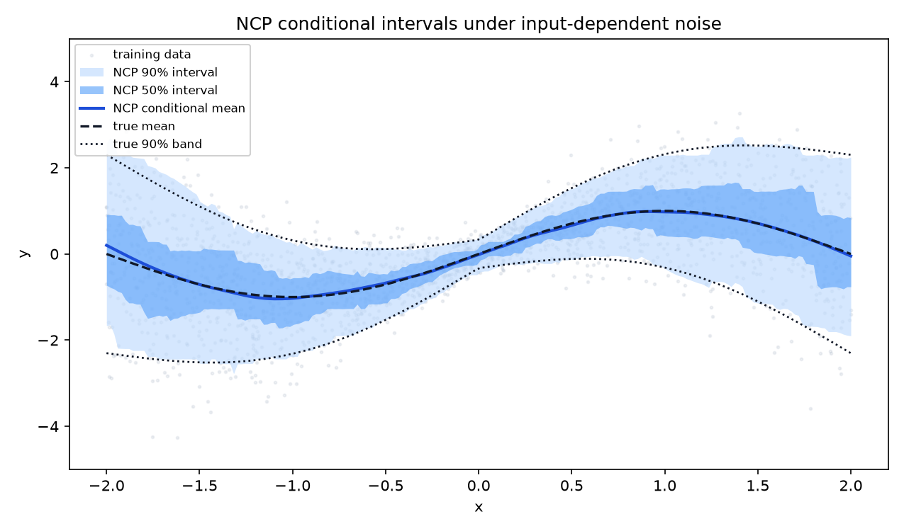
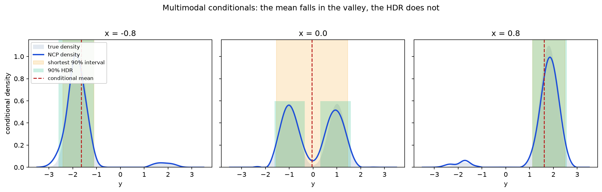

# Posterior Operator — Neural Conditional Probability (NCP)

A PyTorch implementation of **Neural Conditional Probability for Uncertainty
Quantification** (Kostic, Pacreau, Turri, Novelli, Lounici & Pontil, *NeurIPS
2024*) — [paper](https://proceedings.neurips.cc/paper_files/paper/2024/hash/705b97ecb07ae86524d438abac97a3e2-Abstract-Conference.html)
· [arXiv:2407.01171](https://arxiv.org/abs/2407.01171).

Learn a truncated singular value decomposition of the conditional expectation
operator **once, unconditionally**; then read conditional means, variances,
densities, CDFs, quantiles and confidence regions off that decomposition in
closed form, for any conditioning value, with no retraining.

Written from the method description rather than ported from the authors'
[reference code](https://github.com/CSML-IIT-UCL/NCP), which carries no licence.

---

## The method

Let $(X, Y) \sim \pi_{XY}$ with marginals $\pi_X, \pi_Y$. The conditional
expectation operator $E : L^2(\pi_Y) \to L^2(\pi_X)$, $(Eg)(x) = \mathbb{E}[g(Y)
\mid X = x]$, has kernel $p(x,y)/(\pi_X(x)\pi_Y(y))$. Subtracting its trivial
component $\mathbb{1} \otimes \mathbb{1}$ leaves the **deflated density ratio**,
whose truncated SVD is what NCP learns:

$$
\frac{p(y \mid x)}{\pi_Y(y)} \;=\; 1 \;+\; \underbrace{\sum_{k=1}^{d} \sigma_k\, u_k(x)\, v_k(y)}_{r(x,\,y)},
\qquad \sigma_k \in [0, 1].
$$

Two networks supply $u$ and $v$; $\sigma$ is a learned vector. Once you have
$r$, every conditional quantity is a weighted statistic over a reference sample
$\{y_j\}_{j=1}^m \sim \pi_Y$:

$$
\widehat{p}(\cdot \mid x) = \sum_{j=1}^m w_j(x)\,\delta_{y_j},
\qquad w_j(x) = \tfrac1m\big(1 + r(x, y_j)\big).
$$

### Training objective

With $h(x,y) = \sum_k s_k u_k(x) v_k(y)$, the loss is the squared
$L^2(\pi_X \otimes \pi_Y)$ distance to $r$, up to an $h$-independent constant:

$$
\mathcal{L} = \mathbb{E}_{\pi_X \otimes \pi_Y}\big[h^2\big]
  - 2\Big(\mathbb{E}_{\pi_{XY}}[h] - \mathbb{E}_{\pi_X \otimes \pi_Y}[h]\Big)
  = \lVert h - r\rVert^2_{L^2(\pi_X \otimes \pi_Y)} - \lVert r \rVert^2,
$$

using $\mathbb{E}_{\pi_X \otimes \pi_Y}[h\,r] = \mathbb{E}_{\pi_{XY}}[h] -
\mathbb{E}_{\pi_X \otimes \pi_Y}[h]$. **No conditioning value and no
normalising constant appear anywhere** — that is exactly why one fit serves
every $x$. Two unbiased estimators are provided:

| `mode` | estimator | cost | notes |
| --- | --- | --- | --- |
| `"ustat"` (default) | all $n(n-1)$ off-diagonal pairs | $O(nd^2)$ | lower variance; computed Gram-free, no $n \times n$ matrix |
| `"split"` | two independent halves | $O(nd)$ | the paper's split form; cheaper, noisier |

$\mathcal{L}$ is invariant to $u \mapsto A^{-\top}u,\ v \mapsto Av$, so a
penalty pulls $\mathbb{E}[uu^\top]$ and $\mathbb{E}[vv^\top]$ towards the
identity (`"orthonormality"`, or `"log_fro"` which additionally diverges as the
embedding collapses).

### The whitening step

Gradient descent identifies the two *subspaces* but neither an orthonormal
basis for them nor the singular values. A closed-form step
(`fit_statistics`) fixes both: it computes the exact $L^2$ projection of $r$
onto the learned subspaces,

$$
\hat r(x,y) = \varphi_c(x)^\top C_\varphi^{-1} C_{\varphi\psi} C_\psi^{-1} \psi_c(y),
\qquad \varphi = \operatorname{diag}(\sqrt{s})\,u, \quad \psi = \operatorname{diag}(\sqrt{s})\,v,
$$

and re-expresses it as $\sum_k \hat\sigma_k \tilde u_k(x) \tilde v_k(y)$ with
$\tilde u, \tilde v$ centered and orthonormal and $\hat\sigma_k$ the canonical
correlations between the two feature spaces. No gradients, one pass over the
data.

---

## Install

```bash
pip install -e .          # torch + numpy
pip install -e ".[dev]"   # + pytest, matplotlib for the tests and figures
```

## Quick start

```python
import torch
from posterior_operator import Heteroscedastic, build_ncp, train_ncp

data = Heteroscedastic()
g = torch.Generator().manual_seed(0)
x, y = data.sample(8000, generator=g)

operator = build_ncp(x_dim=1, y_dim=1, latent_dim=32)
train_ncp(operator, x, y, epochs=600, validation_data=data.sample(2000, generator=g))

# One fit, then condition on anything — no retraining.
posterior = operator.condition(torch.tensor([[-1.5], [0.0], [1.5]]))

posterior.mean()                      # (3, 1) conditional means
posterior.std()                       # (3, 1) conditional standard deviations
posterior.covariance()                # (3, 1, 1) conditional covariance
posterior.quantile([0.05, 0.5, 0.95]) # (3, 3) conditional quantiles
posterior.interval(alpha=0.1)         # (3, 2) shortest 90% interval
posterior.cdf()                       # step CDF on the reference atoms
posterior.sample(1000)                # (3, 1000, 1) draws
posterior.expectation(lambda y: y**3) # any observable
operator.singular_values              # the estimated spectrum
```

Conditional **densities** additionally need an estimate of $\pi_Y$, since NCP
models the ratio $p(y\mid x)/\pi_Y(y)$:

```python
from posterior_operator import GaussianKDE

grid = torch.linspace(-5, 5, 401)
marginal = GaussianKDE(operator.reference_y)
pdf = posterior.density(grid, marginal)                        # (3, 401)
mask, level = posterior.highest_density_region(grid, marginal, alpha=0.1)
```

`highest_density_region` may be **disjoint**, which is the point on multimodal
targets: the shortest interval has to bridge the low-density valley between
modes, the HDR does not.

---

## Results

`python examples/04_benchmark_table.py --seeds 3` (n=8000, 600 epochs, 2×64 MLPs,
`latent_dim=32`). Hellinger/KS are against the **exact** conditional law; the
oracle columns use the true conditional quantiles.

| dataset | hellinger | KS | cov₉₀ | width | oracle | pinball | oracle | σ̂₁ |
| --- | --- | --- | --- | --- | --- | --- | --- | --- |
| LinearGaussian | 0.057 | 0.025 | **0.902** | 1.669 | 1.645 | 0.125 | 0.125 | 0.895 |
| Heteroscedastic | 0.066 | 0.029 | **0.901** | 2.646 | 2.639 | 0.201 | 0.201 | 0.696 |
| BimodalMixture | 0.080 | 0.020 | **0.905** | 2.465 | 2.869 | 0.205 | 0.205 | 0.782 |
| StudentT | 0.062 | — | **0.899** | 2.337 | — | 0.186 | — | 0.650 |

Coverage lands within 0.005 of nominal on all four, and the pinball loss
matches the oracle to three decimals. The oracle width is the *equal-tailed*
true interval, so on `BimodalMixture` the shortest interval is legitimately
narrower — that column is a reference point, not a lower bound.

On `LinearGaussian` the operator spectrum is also known: for a jointly Gaussian
pair, $E$ diagonalises in the Hermite basis with $\sigma_k = \rho^k$. The fit
recovers $\hat\sigma_1 = 0.8943$ against $\rho = 0.8944$
(`examples/01_gaussian_validation.py`).



Intervals widen with the local noise — conditional coverage holds region by
region (0.882–0.906 across quarters of the input range), not merely on average.



At $x=0$ the conditional mean sits at 3.6% of the peak density. The shortest
interval spans the valley (width 2.99); the HDR splits into two pieces
(width 2.55) for the same 0.93 of true mass.

## Examples

| script | what it shows |
| --- | --- |
| `01_gaussian_validation.py` | validation against a fully closed-form model, including the Hermite spectrum |
| `02_heteroscedastic_intervals.py` | intervals adapting to input-dependent noise; coverage by region |
| `03_multimodal_regions.py` | shortest interval vs highest-density region on a bimodal target |
| `04_benchmark_table.py` | the table above |

---

# Likelihood-free posterior functionals

`posterior_operator.lfi` specialises the operator to simulation-based
inference, following *Likelihood-Free Posterior Functional Inference — train
once, ask whatever next* (Bortolato, 2026). The joint law is the prior
predictive ρ = π ⊗ p(·|θ), the conditioning variable is the **data** and the
response is the **parameter**, so

$$
\frac{p(\theta \mid y)}{\pi(\theta)} = 1 + \sum_{k=1}^{d} \sigma_k\, u_k(y)\, v_k(\theta),
\qquad
\widehat{T}_f(y_0) = \tfrac1n \textstyle\sum_i f(\theta_i)
  + \sum_k \hat\sigma_k \hat u_k(y_0)\big[\tfrac1n \sum_i \hat v_k(\theta_i) f(\theta_i)\big].
$$

That estimator is a weighted average over the prior draws with masses
$w_i(y_0) = \frac1n(1 + \hat r(y_0, \theta_i))$, so every posterior functional,
CDF, credible region and Bayes action is a statistic of one reweighted prior
sample — computed without ever evaluating $p(y \mid \theta)$.

```python
import torch
from posterior_operator import PosteriorOperator
from posterior_operator.simulators import MA2

sim = MA2(n_timesteps=50)
theta, y = sim.sample_joint(40000, generator=torch.Generator().manual_seed(0))

op = PosteriorOperator(theta_dim=2, data_dim=sim.data_dim, rank=48)
op.fit(theta, y, epochs=500)                 # once

post = op.posterior(y[:10])                  # then ask anything
post.functional(lambda t: t**2)              # any f, chosen after training
post.probability(lambda t: t[:, 0] > 0)      # P(theta in B | y)
post.credible_interval(0.05, coordinate=0)   # from the CDF
post.marginal_histogram(0, bins=20)          # nuisance coordinate marginalised
post.bayes_action(loss, actions)             # decision-theoretic target
post.reweight(log_pi - log_q)                # change the prior, no refit

op.maximal_correlation                       # sigma_1 = HGR maximal correlation
op.chi2_divergence                           # sum sigma_k^2 = chi^2(rho || pi x mu)
```

**Signed vs clipped masses.** A density-*ratio* estimate can go negative.
Moment-type queries (`functional`, `mean`, `covariance`, `probability`,
`posterior_risk`) use the masses as they come, which makes them the estimator
above verbatim. Order-statistic queries (`quantile`, `cdf`,
`credible_interval`, `sample`, `marginal_histogram`) need a genuine probability
measure and clip internally; `as_probability()` exposes it. This matters: on an
MA(2) fit where the posterior is 5× tighter than the prior, clipping up front
inflates the reported standard deviation by 3.6× instead of 1.6×.

## Simulators with exact references

| simulator | reference available |
| --- | --- |
| `GaussianLinear` | closed-form posterior, canonical correlations, **and** the exact $L^2$ spectrum |
| `MA2` | exact banded-Gaussian likelihood → reference posterior by quadrature |
| `AR2` | exact stationary Gaussian likelihood (full Toeplitz), Yule-Walker autocovariances |
| `GAndK` | intractable density, recovered numerically by inverting the quantile function |
| `SIR` | mechanistic ODE epidemic; exact likelihood → reference posterior by quadrature |
| `SumIdentified` | closed-form posterior; only $\theta_1+\theta_2$ identified; exact $\sigma_1$ |

`posterior_operator.baselines` supplies the two comparators: `DirectRegression`
(one fit per functional) and `NeuralPosteriorEstimator` (a conditional mixture
density network, i.e. NPE in its original form).

## LFI examples

| script | what it shows |
| --- | --- |
| `lfi/01_gaussian_operator_exact.py` | CCA reconstruction; the exact Hermite spectrum; what rank-$d$ truncation really costs |
| `lfi/02_amortized_functionals.py` | 11 functionals from one fit, each scored against quadrature |
| `lfi/03_prior_retargeting.py` | change the prior after training; ESS; comparison against a refit |
| `lfi/04_identifiability.py` | $\sigma_1$ and $v_1$ as identifiability diagnostics; the compactness warning; rank vs concentration |
| `lfi/05_spectrum_decay.py` | does $\sigma_k$ decay as assumed? MA(2), AR(2), g-and-k, calibrated against the exact Gaussian spectrum |
| `lfi/06_mechanistic_amortization.py` | SIR epidemic: NCP vs NPE vs one-regression-per-functional, on accuracy *and* cost |
| `lfi/07_functional_confidence_intervals.py` | frequentist coverage for $\widehat{T}_f(y_0)$; root-$n$ or not; the bootstrap's actual coverage |

These four cover the first four items of the paper's experimental protocol.

## What the experiments say

Three things reproduce cleanly and are worth carrying into a write-up.

**The diagnostics are sharp.** On `SumIdentified`, $\hat\sigma_1 = 0.9758$
against an exact 0.9759, and $\hat v_1$ recovers the identified direction
$(1,1)/\sqrt2$ to $|\cos| = 1.0000$ — without being told which direction was
identified. The posterior standard deviation comes out 0.2170 along it
(exact 0.2182) and 1.0011 along the orthogonal direction (exact 1.0000, the
untouched prior). Shrinking the observation noise drives $\hat\sigma_1 \to 1$ in
lockstep with the closed form, so the compactness warning fires on cue.

**Amortization works, and moments are the strong suit.** One MA(2) fit answers
mean, second and cross moments, three event probabilities, a posterior risk, a
covariance, marginal histograms, quantiles, an interval and a Bayes action — the
last matching the exact 0.25-quantile it should. Event probabilities land within
0.06–0.11 of quadrature. Tail quantiles are the weak suit: the 90% intervals are
valid but 2–4× too wide.

**The truncation rank is governed by posterior concentration, not by
$\mathrm{rank}(\Sigma_{\Theta Y})$.** As an MA(2) series grows from 5 to 50
observations the posterior tightens from 1.4× to 4.7× the prior, and the
reported spread degrades from 1.18× to 1.63× the truth. Raising the rank from
64 to 256 barely moves it (4.09 → 4.01 clipped), so at these budgets the limit
is optimisation, not the spectrum. Posterior *location* stays accurate
throughout.

### Against the baselines, on a mechanistic simulator

`lfi/06_mechanistic_amortization.py`, SIR epidemic, 30k simulations, mean
absolute error against the exact posterior over 40 held-out observations:

| functional | NCP | NPE | direct regr. | prior-only |
| --- | --- | --- | --- | --- |
| mean (β, γ) | 0.0426 | **0.0158** | 0.0225 | 0.4300 |
| mean R₀ = β/γ | 0.1236 | **0.0583** | 0.0742 | 2.6511 |
| P(R₀ > 1) | 0.0519 | **0.0094** | 0.0122 | 0.1338 |
| 0.9 quantile of R₀ | 2.5745 | **0.0948** | n/a | 5.5681 |

**NPE is more accurate than the operator on every functional**, and direct
regression is close behind on the ones it can target. That is the expected
ordering — this posterior is smooth, unimodal and two-dimensional, which suits
a mixture density network, and a regression optimises for its one target. The
operator's weak row is the tail quantile, where the over-dispersion bites: it
beats prior-only by only 2×, against NPE's 60×.

Where the operator wins is the *shape* of the cost: a new functional is a
weighted average over stored draws at **0.08 ms**, against 72 ms for NPE
(which must resample) and a full refit for a regression. So the claim to make
for it is a cost claim, not an accuracy claim.

### Does σ_k decay as assumed?

`lfi/05_spectrum_decay.py` fits both decay laws on MA(2), AR(2) and g-and-k,
calibrated against the exact Gaussian spectrum. **Geometric decay fits better
than polynomial on every benchmark** (R² ≈ 0.98–0.99 against 0.83–0.90),
including on the exact spectrum where there is no estimation error.

That is *good* news for the rank-selection bound: geometric decay makes
$\sum_{k>d}\sigma_k^2$ fall geometrically in $d$, so the truncation-bias term
is far smaller than a Sobolev-type polynomial assumption allows, and the oracle
rank grows logarithmically rather than polynomially in the target accuracy.
Worth stating the bound under geometric decay as the primary case.

The models differ enormously in difficulty, though: AR(2) needs $d = 8$ to
capture 99% of $\sum_k \sigma_k^2$, while g-and-k still leaves 23% outside
$d = 16$. Rank selection is model-specific. (The estimated spectrum tracks the
truth at the top and undershoots in the tail at large $n$, so the fitted rates
and tails are mildly optimistic — the script measures that bias rather than
assuming it.)

Two claims did **not** survive testing, both worth knowing before relying on
them:

- **Rank-$r^*$ exactness in the Gaussian case.** A jointly Gaussian pair has a
  rank-$r^*$ cross-covariance but *infinitely many* non-zero singular values:
  the operator is diagonal in the Hermite tensor basis with
  $\sigma_a = \prod_i \rho_i^{a_i}$ (verified by quadrature to $4 \times
  10^{-16}$). Because the top-$d$ directions are ordered by singular value, a
  *nonlinear* direction of a strongly correlated pair can outrank a weakly
  correlated *linear* one. With $\rho = (0.966, 0.917, 0.787)$ the third linear
  direction sits at spectral position **14**, so rank-3 truncation misses part
  of $\mathbb{E}[\Theta\mid Y]$. The sharp statement is
  $d \ge \#\{a \neq 0 : \prod_i \rho_i^{a_i} \ge \rho_{r^*}\}$, which collapses
  to $d \ge r^*$ exactly when $\rho_1^2 < \rho_{r^*}$.
- **Prior retargeting as a free lunch.** The self-normalised identity is exact
  in population, but the weights multiply the *estimated* proposal posterior, so
  the error interacts with them instead of cancelling. Retargeting a flat-prior
  MA(2) fit to a concentrated prior gives mean error 0.31, against 0.11 for a
  refit under that prior at equal simulation budget. Retargeting is free of
  *retraining*, not of *error* — which is an argument for folding the weights
  into the training objective rather than correcting afterwards.

---

## Practical notes

Two things are worth knowing before tuning, both measured rather than assumed.

**`latent_dim` is a ceiling, not a cost.** It caps the rank of the
representable dependence. Unneeded directions get singular values near zero and
can be dropped at inference with `condition(x, rank=r)`; there is no need to
tune it downward. Rank truncation stays a valid probability law, but a learned
singular direction is a *mixture* of the true ones at finite sample, so a
low-rank conditional mean is shrunk towards the marginal rather than merely
noisier.

**The whitening step is a plug-in CCA, so its singular values are biased
upward.** The bias grows with `latent_dim` and shrinks with sample size, and it
is a property of the estimator, not of reusing training data: it appears
identically with *untrained* embeddings, and whitening on a fully independent
sample does not remove it. Consequently:

- **Sample splitting is not the fix it looks like.** `train_ncp(...,
  stats_fraction=0.2)` measurably *worsens* the spectrum, the conditional mean,
  the density and the coverage on the Gaussian benchmark, because it only costs
  training data. The default is `0.0` — whiten on everything.
- **`stats_reg` is the lever.** Raising it towards `1e-3` cuts the maximum
  spectrum error from 0.054 to 0.022, at the price of over-smoothing the ratio
  — which widens intervals past nominal and costs density accuracy. The default
  `1e-6` favours calibrated conditional quantities; raise it if the reported
  spectrum is itself the output you care about.

Other defaults: standardise `X` and `Y` (`Standardizer`) — the whitening step
inverts a feature covariance, so poorly scaled inputs show up as an
ill-conditioned inverse. Prefer full-batch training, since the U-statistic uses
all $n(n-1)$ cross pairs and larger batches cut its variance. Conditional
weights are clipped at zero and renormalised by default (`clip=False` exposes
the raw signed estimate, and `cdf(monotone=True)` repairs the resulting
non-monotone CDF by isotonic regression).

## Layout

```
posterior_operator/
  nn.py          MLP embeddings; singular values parametrised as exp(-w^2) in (0,1]
  losses.py      the objective, its two unbiased estimators, and the penalties
  operator.py    NCPOperator: embeddings, whitening, conditional weights
  inference.py   ConditionalDistribution (moments, CDF, quantiles, regions), GaussianKDE
  training.py    dependency-free training loop with early stopping
  data.py        four synthetic generators with closed-form ground truth
  metrics.py     Hellinger, TV, KL, JS, KS, W1, coverage, pinball
  lfi.py         PosteriorOperator / PosteriorSample: posterior functionals, retargeting
  simulators.py  GaussianLinear, MA2, SumIdentified, with exact references
tests/           211 tests; run with `pytest`
examples/        general conditional-density scripts
examples/lfi/    the likelihood-free scripts
```

Tests pin the objective against a finite joint distribution where $r$ and every
expectation are exact, the whitening algebra against a hand-written
least-squares projection, and the inference functionals against brute-force
searches.

## Citation

```bibtex
@inproceedings{kostic2024neural,
  title     = {Neural Conditional Probability for Uncertainty Quantification},
  author    = {Kostic, Vladimir R. and Pacreau, Gr{\'e}goire and Turri, Giacomo
               and Novelli, Pietro and Lounici, Karim and Pontil, Massimiliano},
  booktitle = {Advances in Neural Information Processing Systems 37 (NeurIPS)},
  year      = {2024}
}
```
